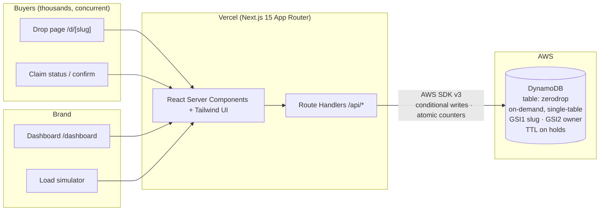

# PLAN — H0: Hack the Zero Stack

**Hackathon:** [H0: Hack the Zero Stack with Vercel v0 and AWS Databases](https://h01.devpost.com/)
**Deadline:** June 29, 2026, 5:00 PM PDT (AWS credits request deadline: June 26, 12:00 PM PT)
**Prizes:** $10k/$5k/$3k cash + matching AWS credits per track, plus four $2k "Best Of" prizes.

---

## Concept: **ZeroDrop**

> **Sell out. Never oversell.** Oversell-proof flash drops for independent brands.

Limited product drops (sneakers, vinyl, prints, concert merch, micro-batch goods) are a
multi-billion dollar segment, and the #1 way small brands destroy customer trust is
**overselling**: 500 people check out, 300 get a refund email. It happens because
read-then-write inventory logic collapses under concurrent traffic.

ZeroDrop is a SaaS where a brand creates a drop in 60 seconds, shares one link, and
**physically cannot oversell** — every claim is a single DynamoDB **conditional write**
(`claimed < totalStock`), so correctness is enforced by the database, not by application
locks. Sold out? Buyers land on an atomic waitlist with a guaranteed position. Claims are
held for 10 minutes with **DynamoDB TTL** and auto-release stock if not confirmed.

The signature demo moment: the dashboard has a **"Simulate N buyers"** stress-test button
that fires hundreds of concurrent claim attempts at a live drop. The stock bar races to
exactly 100/100 — never 101 — while the waitlist fills. The database guarantee *is* the
product pitch, and it's provable on camera in 20 seconds.

### Why this can win

| Criterion | Angle |
|---|---|
| **Technical implementation** | True single-table DynamoDB design; atomic conditional writes as the concurrency primitive (no locks, no transactions needed); TTL for hold expiry with lazy-read reconciliation; GSIs for slug routing and per-brand listings; on-demand capacity = serverless end-to-end with Vercel. |
| **Design** | One focused flow, polished dark "hype-drop" aesthetic, live-updating stock bars, countdowns, hold timers. The backend guarantee is surfaced *in the UI* ("Oversell-proof — enforced by DynamoDB conditional writes"). |
| **Impact** | Real, named pain (oversold drops, refund storms, bot-era trust). Ship-ready: the architecture is exactly what you'd run in production. |
| **Originality** | Not an AI wrapper. The insight is "make the database guarantee the product feature" — and prove it live with an embedded load test. |

### Track: **Monetizable B2B App**

Brands/creators are the paying customer. Pricing (shown on the landing page):
- **Free** — 1 drop/mo, 50 units
- **Indie $29/mo** — unlimited drops, 1k units/drop, custom slug
- **Pro $99/mo + 1% per claim** — waitlist exports, multi-region, API access

DynamoDB on-demand means COGS per drop is fractions of a cent — the margin story is real.

### Explicitly avoided
Generic AI-chatbot wrappers, anything cybersecurity-flavored, CRUD-only apps where the
database choice is incidental.

---

## Architecture



### Single-table design (table `zerodrop`)

| Entity | PK | SK | GSI1PK / GSI1SK | GSI2PK / GSI2SK | Notes |
|---|---|---|---|---|---|
| Brand user | `USER#<email>` | `PROFILE` | — | — | passwordHash (scrypt), name |
| Drop | `DROP#<id>` | `META` | `SLUG#<slug>` / `META` | `USER#<email>` / `DROP#<createdAt>` | `claimed`, `waitlistCount` are **atomic counters** |
| Claim | `DROP#<id>` | `CLAIM#<ulid>` | — | — | status HELD→CONFIRMED / EXPIRED / WAITLIST; `expiresAt` = DynamoDB **TTL** |

### The core write (the whole product in one call)

```
UpdateItem(PK=DROP#id, SK=META)
  ConditionExpression: claimed < totalStock AND #status = :live
  UpdateExpression:    SET claimed = claimed + :one
```

- Success → claim number = new `claimed` value; write HELD claim item with TTL.
- `ConditionalCheckFailedException` → `ADD waitlistCount :one` → atomic waitlist position.
- Confirm: conditional flip HELD→CONFIRMED (only if not expired).
- Expired holds: TTL deletes the item server-side; reads lazily reconcile (conditional
  HELD→EXPIRED flip acts as a mutex, winner decrements `claimed`). No distributed locks anywhere.

### Local development (no AWS account needed)
- `npm run db:local` boots **dynalite** (pure-JS DynamoDB emulator) on :8005 — no Docker required.
- `docker-compose.yml` provided as an alternative (`amazon/dynamodb-local`).
- `npm run db:seed` creates the table + GSIs + TTL and seeds a demo brand, live drops, and claims.
- The app code is identical local vs prod — only `DYNAMODB_ENDPOINT` changes.

---

## Build schedule (deadline Jun 29)

| Date | Milestone |
|---|---|
| **Jun 12** | Research rules ✅ · PLAN.md ✅ · Scaffold Next.js · data layer · API routes · all pages · seed · local test · SETUP.md · DEMO_SCRIPT.md |
| Jun 13–14 | Polish UI, edge cases, mobile pass, empty states, error states |
| Jun 15 | **Jerom:** create AWS account/creds, request $100 AWS + $30 v0 credits (form deadline Jun 26!), create DynamoDB table via seed script |
| Jun 16 | Deploy to Vercel with real DynamoDB; smoke test prod; capture AWS console screenshot |
| Jun 17–20 | Buffer: bugfixes, copy polish, architecture diagram export (draw.io/Excalidraw from mermaid) |
| Jun 21–22 | Record <3 min demo video per DEMO_SCRIPT.md; upload to YouTube |
| Jun 23–24 | Optional +0.6 bonus: publish up to 3 pieces (Dev.to/LinkedIn/builder.aws.com) with **#H0Hackathon** |
| Jun 25–27 | Devpost submission draft: description, video, diagram, screenshot, Vercel link + Team ID, test credentials |
| Jun 28 | Final review, submit (don't wait for the 29th) |

## Submission checklist (from rules)
- [ ] Published Vercel deployment URL
- [ ] Vercel **Team ID**
- [ ] Text description of features/functionality
- [ ] Demo video **< 3 min**, on YouTube/Vimeo, shows app working **and** the AWS database
- [ ] Architecture diagram (frontend ↔ backend ↔ DynamoDB, labeled arrows)
- [ ] Screenshot proving DynamoDB usage (AWS console: table items + metrics)
- [ ] Database used: **DynamoDB**
- [ ] Test credentials (demo brand login)
- [ ] Optional: ≤3 published content pieces with #H0Hackathon (+0.2 each)
