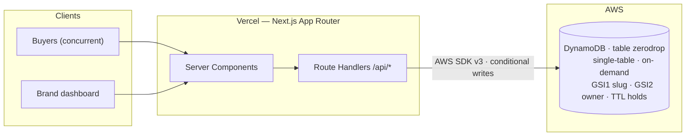

# ZeroDrop — Sell out. Never oversell.

**H0: Hack the Zero Stack** entry · Track: **Monetizable B2B** · Database: **Amazon DynamoDB** · Frontend: **Next.js on Vercel**

ZeroDrop is a SaaS for independent brands running limited product drops (sneakers, vinyl,
prints, micro-batch goods). Its core promise: **overselling is impossible by construction.**
Every claim is a single DynamoDB conditional write — there are no locks and no
read-modify-write races anywhere in the hot path. The dashboard even ships a stress-test
button that fires up to 1,000 concurrent buyers at a live drop so you can watch the
guarantee hold in real time.

## Quick start (no AWS account needed)

```bash
npm install
npm run db:local    # terminal 1: local DynamoDB emulator (dynalite, no Docker)
npm run db:seed     # terminal 2: create table + GSIs + demo data
npm run dev         # terminal 2: app on http://localhost:3000
```

Demo brand login: **demo@zerodrop.app / drop-zero-2026**

Have Docker instead? `docker compose up` runs the official `amazon/dynamodb-local`
image on the same port — everything else is identical.

## The five-minute tour

1. Open `/` — landing page with a live seeded drop.
2. Log in (`/login`, "Use the demo account") — dashboard with live atomic counters.
3. Open the **AURA-1 Sneaker** drop → **Unleash the stampede** (250 concurrent buyers).
   Watch the stock bar race to exactly 100/100. Oversold: **0**. Always 0.
4. Visit the public page `/d/aura-1-lunar` as a buyer — claim, get a 10-minute hold
   with a live countdown, confirm with the demo checkout.
5. Sold out? You get an atomic waitlist position instead.

## Architecture



### Single-table design

| Entity | PK | SK | GSI1 | GSI2 |
|---|---|---|---|---|
| Brand user | `USER#email` | `PROFILE` | — | — |
| Drop | `DROP#id` | `META` | `SLUG#slug` | `USER#email` / `DROP#createdAt` |
| Claim | `DROP#id` | `CLAIM#ulid` | — | — |

### The entire claim path is one write

```text
UpdateItem(DROP#id, META)
  ConditionExpression: claimed < totalStock AND status = live AND startsAt <= now
  UpdateExpression:    SET claimed = claimed + 1
```

DynamoDB serializes every writer, so N units means exactly N winners. Sold out claims
fall through to `ADD waitlistCount 1` — an atomic waitlist position. Holds last 10
minutes: confirmed via a conditional `HELD → CONFIRMED` flip, abandoned ones flipped
lazily on read (`HELD → EXPIRED` is the mutex; the winner returns the unit to stock)
and hard-deleted by **DynamoDB TTL** an hour later.

## Repo map

```
lib/drops.ts        the data layer — all the DynamoDB craft lives here
lib/db.ts           client factory (local emulator <-> real AWS via env)
lib/auth.ts         scrypt passwords + HMAC-signed session cookies
app/api/**          route handlers (claim, simulate, confirm, auth, CRUD)
app/d/[slug]        public drop page (countdown, live stock, claim)
app/dashboard/**    brand dashboard + live drop admin with stress test
scripts/            dynalite launcher, idempotent table init, seed
```

## Docs

- [PLAN.md](./PLAN.md) — concept, track rationale, schedule
- [SETUP.md](./SETUP.md) — AWS + Vercel deployment runbook
- [DEMO_SCRIPT.md](./DEMO_SCRIPT.md) — <3 min demo video script
