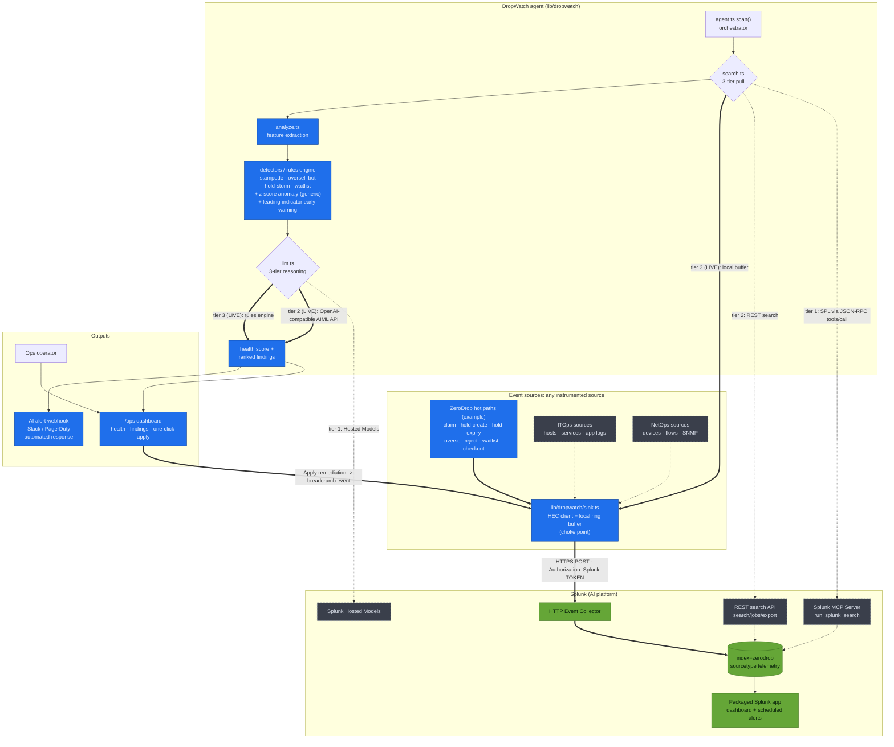
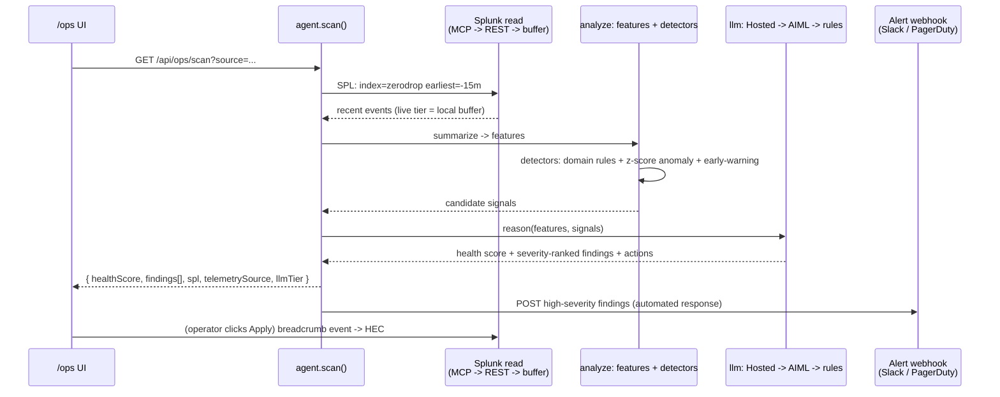

# Architecture: DropWatch, a general agentic observability layer on Splunk

DropWatch is not tied to one app. It is a **general observability agent**: any
instrumented source (an app's hot paths, an ITOps host, a NetOps device) emits
telemetry into Splunk over HEC, and the DropWatch agent **reads it back**,
extracts features, runs **detectors** (domain rules plus a generic z-score
anomaly detector and a leading-indicator early-warning), reasons over the result
with an **LLM**, and emits a **health score + ranked findings**. Those findings
drive a `/ops` dashboard with one-click apply, an **AI alert webhook**
(Slack / PagerDuty) for automated response, and the packaged Splunk app's own
scheduled alerts. ZeroDrop is shown as the worked example source.

Each read tier and reasoning tier degrades gracefully, so the agent always
returns findings even with nothing but a local buffer and the rules engine.

## System diagram

### Legend

- **`==>` thick / blue `live` nodes are LIVE.** Running on the demo deployment:
  ZeroDrop HEC ingest, the local ring buffer read tier, feature extraction +
  detectors, the OpenAI-compatible AIML reasoning tier, the rules-engine
  fallback, the `/ops` dashboard with apply, and the AI alert webhook.
- **`-.->` dashed / grey `wired` nodes are WIRED, not live on the Cloud trial.**
  Coded and ready but unverified end-to-end here: the Splunk **MCP Server** read
  tier, the **REST search** read tier, **Splunk Hosted Models** reasoning, and
  the additional **ITOps / NetOps** source connectors. These are never claimed
  as live.
- **Green `splunk` nodes** are Splunk platform components.

## The agentic loop (one `scan()` cycle)

## Key design choices

- **Source-agnostic by design.** Detectors split into domain rules (stampede,
  oversell-bot, hold-storm, waitlist) and **generic** detectors (z-score anomaly
  + leading-indicator early-warning), so the same agent serves ITOps and NetOps
  sources, not just ZeroDrop.
- **Telemetry never breaks the source.** Emission is fire-and-forget and the HEC
  client no-ops without env, so a source's latency and correctness guarantees
  are untouched.
- **Splunk is the system of record; the ring buffer is a hot cache** that keeps
  mock mode and local dev fully offline-capable.
- **Graceful degradation everywhere:** MCP -> REST -> buffer for reads, Hosted
  Models -> AIML -> rules for reasoning. The agent always returns findings.
- **Findings fan out three ways:** interactive `/ops` apply, automated webhook
  (Slack / PagerDuty), and the packaged Splunk app's scheduled alerts.
- **No heavy dependencies:** stdlib `fetch`/`http` only, so the layer is light
  and disk-cheap.
