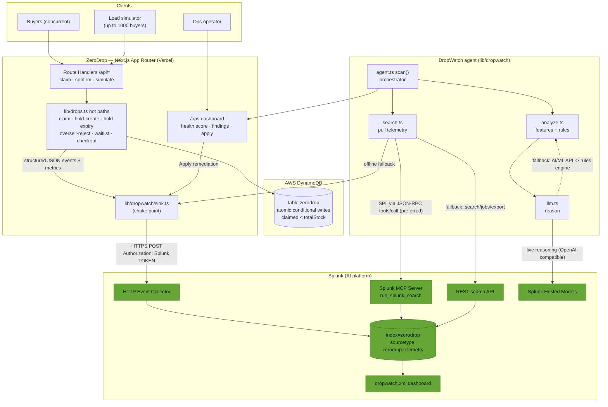
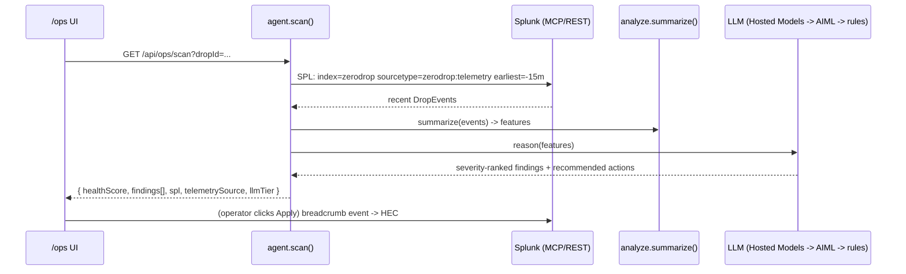

# Architecture — DropWatch agentic observability on ZeroDrop

Data flows in two directions around Splunk: ZeroDrop **emits** telemetry into
Splunk via HEC, and the DropWatch agent **reads it back** (via the Splunk MCP
Server, REST search, or — offline — a local buffer), reasons over it with an
LLM, and surfaces remediations at `/ops`.

## The agentic loop (one `scan()` cycle)

## Key design choices

- **Telemetry never breaks the hot path.** Emission is fire-and-forget and the
  HEC client no-ops without env — ZeroDrop's latency and oversell guarantee are
  untouched.
- **Splunk is the system of record; the ring buffer is a hot cache** that also
  makes mock mode and local dev fully offline-capable.
- **Graceful degradation everywhere:** MCP → REST → buffer for reads; Hosted
  Models → AIML → rules for reasoning. The agent always returns findings.
- **No heavy dependencies** — stdlib `fetch`/`http` only, so the layer is light
  and disk-cheap.
